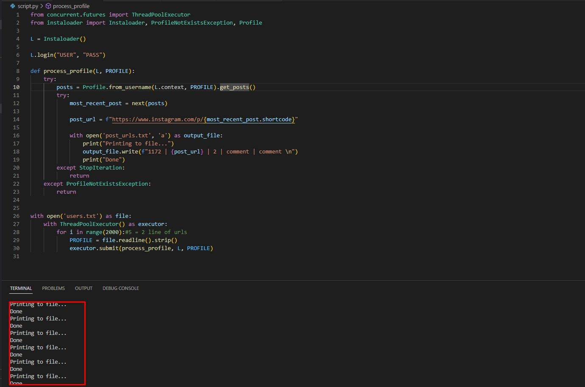

<h2>About the Script:</h2>

This script uses the concurrent.futures module to implement multithreading.
It uses the Instaloader class from the instaloader module to interact with Instagram.
The script logs in to Instagram using the provided username and password.
It then defines a process_profile function that processes each profile and writes the post URL to a file.
The script opens the users.txt file and creates a ThreadPoolExecutor to execute multiple threads concurrently.
For each profile in the users.txt file, the process_profile function is submitted to the executor.
The process_profile function processes each profile and writes the post URL to a file.
This allows the script to process multiple profiles concurrently, speeding up the process.
If the profile does not exist, or if the profile does not have any posts, the process_profile function simply returns without doing anything.
This script can be used to quickly process a large number of Instagram profiles and write their post URLs to a file.
The ThreadPoolExecutor is used to execute multiple threads concurrently, which speeds up the process.
The process_profile function is called for each profile in the users.txt file, and it writes the post URL to a file.
The process_profile function also handles exceptions for profiles that do not exist or do not have any posts.
This script provides a simple and efficient way to process a large number of Instagram profiles and write their post URLs to a file.

<b>In one line : This script uses multithreading to concurrently process multiple Instagram profiles, logs in to Instagram using provided credentials, reads profiles from a file, processes each profile, and writes the post URL for each profile to a file.

.</b>

<h2>How to install?</h2>

<code>pip install -r requirements </code>

<h2> How to run?</h2>
<text>Run the main script called <code>script.py</code></text>

<h2>Created By Orel Mizrahi Adani</h2>

Useful Links:

Download Python : https://www.python.org/
Install Pip : https://pypi.org/project/pip/

Linkedin : https://www.linkedin.com/in/orelmizrahiadani/
Github : https://github.com/orelmizrahii

